# Pull, Otimização e Avaliação de Prompts com LangChain e LangSmith

## Sobre o projeto

Este projeto faz o pull de um prompt de baixa qualidade (`leonanluppi/bug_to_user_story_v1`) do LangSmith Prompt Hub, refatora-o aplicando técnicas de Prompt Engineering e publica a versão otimizada (`bug_to_user_story_v2`) de volta ao Hub. A qualidade da versão otimizada é avaliada automaticamente contra um dataset de 15 relatos de bugs (5 simples, 7 médios, 3 complexos), usando 5 métricas (Helpfulness, Correctness, F1-Score, Clarity, Precision) geradas por LLM-as-judge.

- **Modelo de geração**: `gpt-4o-mini`
- **Modelo de avaliação (juiz)**: `gpt-4o`
- **Critério de aprovação**: todas as 5 métricas ≥ 0.9 e média geral ≥ 0.9

> **Nota sobre o critério:** o enunciado original do desafio (`devfullcycle/mba-ia-pull-evaluation-prompt`) define o mínimo como 0.8 em todas as métricas. O `src/evaluate.py` fornecido (arquivo que não deve ser alterado) já impõe um critério mais estrito - todas as métricas + média ≥ 0.9 -, que é o que este projeto efetivamente segue e atende. Os resultados da seção B atendem a ambos os critérios.

## Estrutura do projeto

```
mba-ia-pull-evaluation-prompt/
├── .env.example
├── requirements.txt
├── README.md
├── prompts/
│   ├── bug_to_user_story_v1.yml   # Prompt original (baixa qualidade)
│   └── bug_to_user_story_v2.yml   # Prompt otimizado (v7.5.1)
├── datasets/
│   └── bug_to_user_story.jsonl    # 15 exemplos de bugs com referência
├── docs/
│   └── evidencias/                # Screenshots de evidência (LangSmith)
├── src/
│   ├── pull_prompts.py            # Pull do prompt v1 do LangSmith Hub
│   ├── push_prompts.py            # Push do prompt v2 para o LangSmith Hub
│   ├── evaluate.py                # Avaliação automática (5 métricas)
│   ├── metrics.py                 # Implementação das 5 métricas
│   └── utils.py                   # Funções auxiliares
└── tests/
    └── test_prompts.py            # Testes de validação do prompt v2
```

---

## A) Técnicas Aplicadas (Fase 2)

O prompt `bug_to_user_story_v2` combina quatro técnicas. As duas primeiras eram obrigatórias pelo desafio; as outras duas foram adicionadas porque, durante as iterações, regras gerais em prosa eram seguidas de forma inconsistente pelo `gpt-4o-mini` - e essas duas técnicas resolveram esse problema.

### 1. Role Prompting

O prompt abre definindo persona e formato de entrega:

> "Você é um Product Manager ágil. Converte um relato de bug em uma User Story enxuta com Critérios de Aceitação, no idioma do relato (português). Entrega apenas o documento em Markdown - sem preâmbulo, saudação ou comentário."

**Por quê:** sem uma persona definida, o modelo tendia a responder como um assistente genérico (explicando o que ia fazer, acrescentando comentários). Fixar o papel de PM ágil concentra a saída no artefato esperado (User Story + Critérios de Aceitação) e no tom certo.

### 2. Few-shot Learning

O prompt inclui 6 exemplos completos (entrada → saída), cada um cobrindo um padrão diferente do dataset:

- **Exemplo A** - bug simples de paridade entre navegadores
- **Exemplo A2** - bug simples de validação de campo
- **Exemplo B** - bug médio de mudança de status via webhook (perspectiva do sistema)
- **Exemplo C** - bug médio de controle de acesso/permissão
- **Exemplo D** - bug médio de recurso esgotado (estoque), com bloco de prevenção
- **Exemplo E** - bug médio de modal/overlay, com critérios de acessibilidade

**Por quê:** ao longo das iterações ficou claro que regras descritas apenas em texto ("inclua sempre X", "nunca faça Y") eram frequentemente ignoradas pelo `gpt-4o-mini`, enquanto o mesmo padrão demonstrado em um exemplo completo era replicado de forma confiável. Cada exemplo foi escrito em domínios fora do dataset de avaliação (para não vazar respostas) mas com a mesma densidade e estrutura das referências.

### 3. Structured Output (contrato de seções por complexidade)

A seção `### NIVEL E SECOES` classifica o relato em SIMPLES / MÉDIO / COMPLEXO e define, para cada nível, exatamente quais seções Markdown a saída deve ter - por exemplo:

> "SIMPLES ... Seções: `## User Story` + `## Criterios de Aceitacao` - e nada mais."
> "COMPLEXO ... Seções: `## User Story` + `## Criterios de Aceitacao` (blocos A, B, C...) + `## Criterios Tecnicos` + `## Contexto do Bug` + `## Tasks Tecnicas Sugeridas` + `## Metricas de Sucesso`."

**Por quê:** sem esse contrato, o modelo aplicava a mesma estrutura "rica" (com seções técnicas extras) para bugs simples, e essas seções extras - não esperadas pela referência - penalizavam a métrica de Precision.

### 4. Negative Constraints / Density Matching (Princípio Central)

Logo após o papel, o prompt define a regra que rege todo o resto:

> "Espelhe a densidade de uma boa User Story de referência: diga tudo o que o relato pede e NADA além disso. Conteúdo plausível mas não pedido (testes, monitoramento, retry, indicadores de progresso, logs de auditoria, e-mails de confirmação, seções extras) reduz a nota tanto quanto uma omissão."

**Por quê:** o erro mais recorrente nas primeiras versões era o modelo "ajudar demais" - acrescentando testes, monitoramento, logs e seções que pareciam boas práticas mas não estavam na referência esperada. Essa regra negativa, reforçada pelos exemplos few-shot (que já têm a densidade certa), foi o que mais elevou Precision e Correctness ao longo das versões.

---

## B) Resultados Finais

### Tabela comparativa v1 (baseline) vs v2 (otimizado)

| Métrica | v1 (baseline) | v2 (`v7.5.1`) |
|---|---|---|
| Helpfulness | 0.45 ✗ | 0.94 ✓ |
| Correctness | 0.52 ✗ | 0.93 ✓ |
| F1-Score | 0.48 ✗ | 0.91 ✓ |
| Clarity | 0.50 ✗ | 0.93 ✓ |
| Precision | 0.46 ✗ | 0.95 ✓ |
| **Média geral** | **0.48 ✗** | **0.9318 ✓** |
| **Status** | ❌ REPROVADO | ✅ APROVADO |

### Evidências do LangSmith

- **Prompt otimizado publicado no Prompt Hub** (`Public`): https://smith.langchain.com/hub/leandrocoe-labs/bug_to_user_story_v2
- **Projeto de avaliação no LangSmith**: `projet-langsmith-prompts` - dataset com 15 exemplos e tracing de todas as execuções (prints abaixo)

#### Saída da execução aprovada (`python src/evaluate.py`)

```
🔍 Avaliando: leandrocoe-labs/bug_to_user_story_v2
   Dataset: 15 exemplos

==================================================
Prompt: leandrocoe-labs/bug_to_user_story_v2
==================================================

Métricas Derivadas:
  - Helpfulness: 0.94 ✓
  - Correctness: 0.93 ✓

Métricas Base:
  - F1-Score: 0.91 ✓
  - Clarity: 0.93 ✓
  - Precision: 0.95 ✓

--------------------------------------------------
📊 MÉDIA GERAL: 0.9318
--------------------------------------------------

✅ STATUS: APROVADO - Todas as métricas >= 0.9
```

<details>
<summary>Segunda execução independente (reprodutibilidade - média 0.9210, também aprovada)</summary>

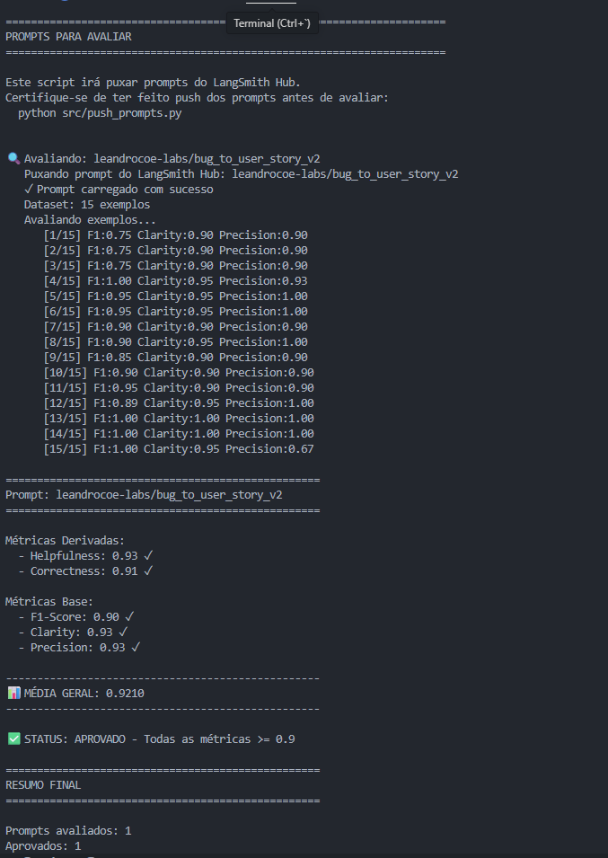

</details>

#### Tracing detalhado por exemplo (dashboard do LangSmith)

Cada execução gera 3 chamadas de avaliação por exemplo (Precisão/Recall, Clareza, Correção/Alucinação), visíveis individualmente no tracing do projeto `projet-langsmith-prompts`:

<details>
<summary><b>Exemplo 1 - "Adicionar ao Carrinho não funciona" (bug simples)</b></summary>

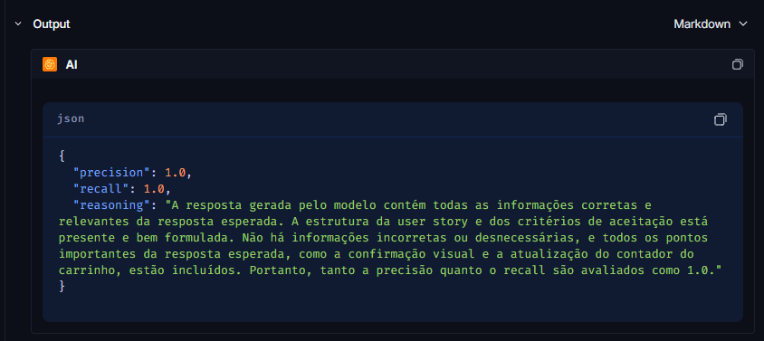
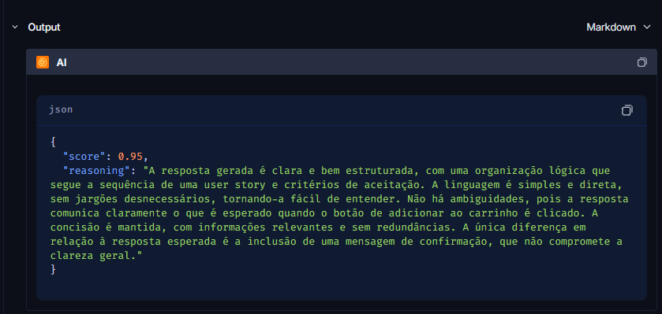
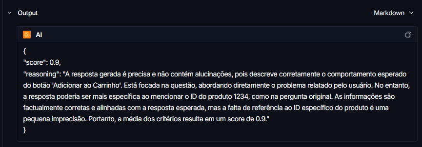

</details>

<details>
<summary><b>Exemplo 2 - Validação de campo de e-mail (bug simples)</b></summary>

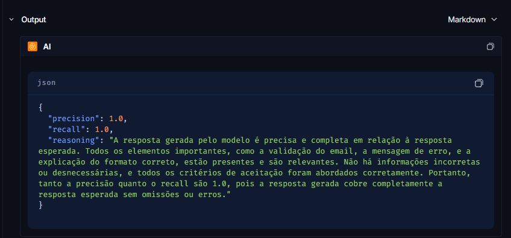
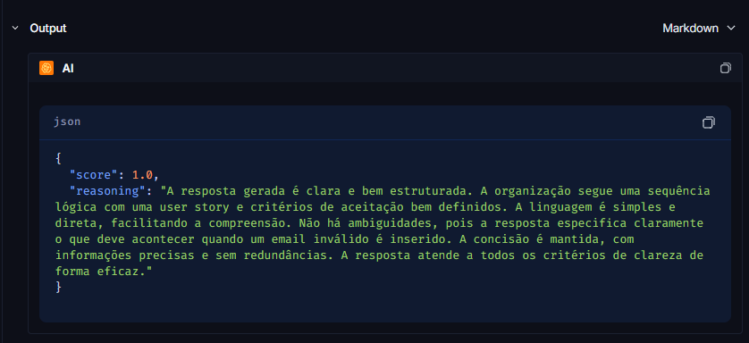
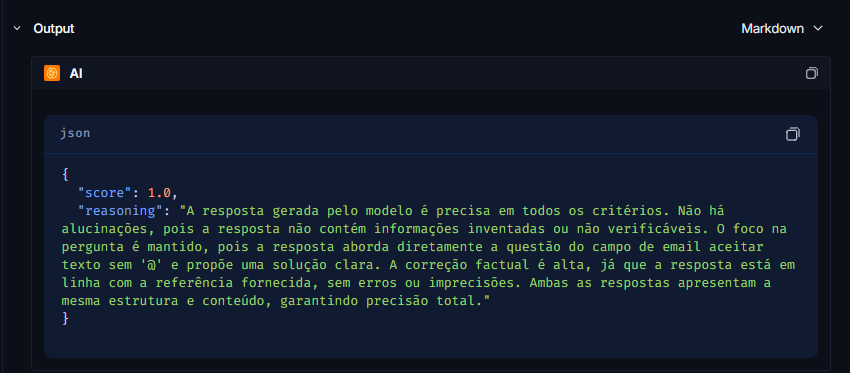

</details>

<details>
<summary><b>Exemplo 3 - Layout da tela de perfil ao girar para landscape (iOS)</b></summary>

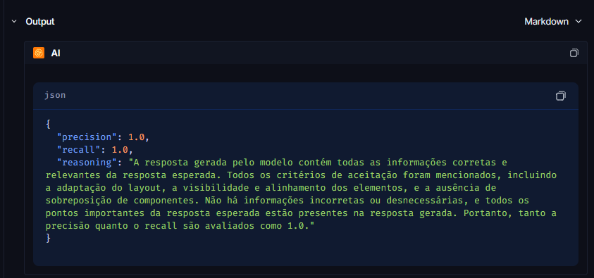
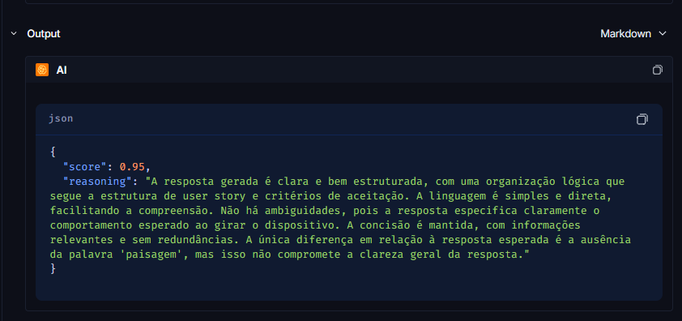
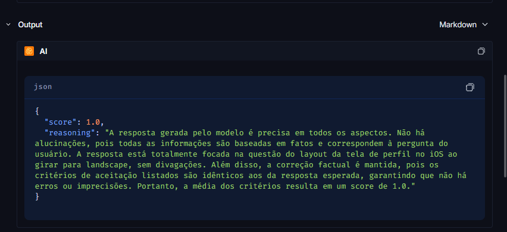

</details>

<details>
<summary><b>Exemplo 4 - Contagem de usuários ativos no dashboard</b></summary>

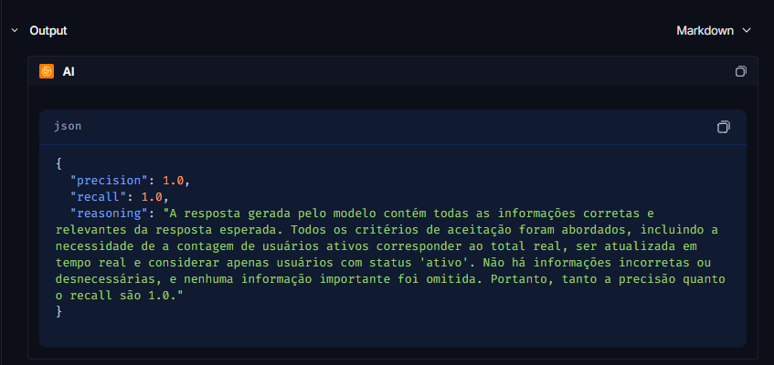
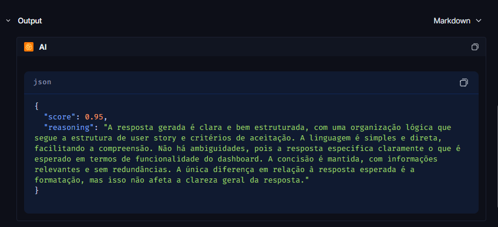
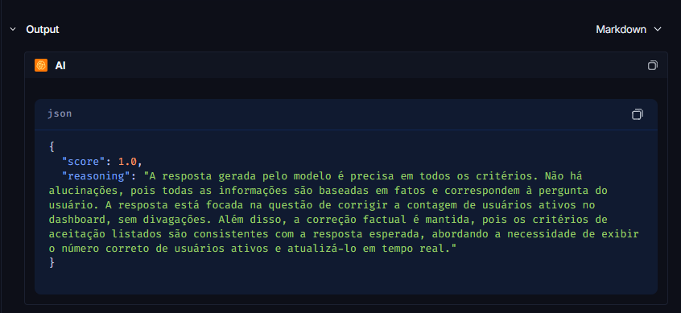

</details>

---

## C) Como Executar

### Pré-requisitos

```bash
python3 -m venv .venv
.venv\Scripts\activate   # Windows
pip install -r requirements.txt
```

Copie `.env.example` para `.env` e preencha:

- `LANGSMITH_API_KEY` e `LANGSMITH_PROJECT` - credenciais do LangSmith (`LANGSMITH_TRACING=true` para habilitar o tracing)
- `USERNAME_LANGSMITH_HUB` - seu usuário no Prompt Hub (usado para nomear o prompt publicado como `{username}/bug_to_user_story_v2`)
- `OPENAI_API_KEY` (ou `GOOGLE_API_KEY`) - chave do provedor de LLM
- `LLM_PROVIDER` / `LLM_MODEL` / `EVAL_MODEL` - `openai` + `gpt-4o-mini` (geração) + `gpt-4o` (avaliação), ou `google` + `gemini-2.5-flash` para ambos no plano free

### Passo a passo

```bash
# 1. Pull do prompt v1 (baixa qualidade) do LangSmith Hub
python src/pull_prompts.py

# 2. prompts/bug_to_user_story_v2.yml já contém o prompt otimizado (v7.5.1)

# 3. Push do prompt v2 para o LangSmith Prompt Hub (público)
python src/push_prompts.py

# 4. Avaliação automática contra os 15 exemplos do dataset
python src/evaluate.py

# 5. Testes de validação do prompt (estrutura, few-shot, técnicas)
pytest tests/test_prompts.py
```

> Por variância do juiz LLM (gpt-4o), os valores de F1-Score e Clarity podem oscilar levemente entre execuções. Caso uma rodada reprove por margem pequena (ex: 0.87-0.89 em alguma métrica), rode `python src/evaluate.py` novamente sem alterar o prompt - é o comportamento esperado e documentado no histórico de versões do `bug_to_user_story_v2.yml`.
